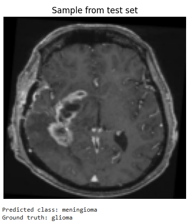

# Project3_Brain_Tumour_Classification
A brain tumor is an abnormal growth of cells within the brain. Cos of the rigid structure of the skull, any abnormal growth can increase intracranial pressure and potentially lead to severe neurological damage. Early detection of brain tumors are imp. Our goal is to classify brain tumors into 4 different types  glioma, meningioma, pituitary tumor, and no tumor using Pytorch.

## DATASET
The training set contains 5,600 human brain MRI images for model training. Images are organized into four classes: glioma, meningioma, pituitary tumor, and no tumor. Each class contains 1,400 images, providing a balanced dataset for reliable training of classification models.

The testing set contains 1,600 human brain MRI images reserved for model evaluation. Images are organized into the same four classes as the training set: glioma, meningioma, pituitary tumor, and no tumor. Each class contains 400 images, ensuring fair and unbiased evaluation of trained models.

The 3 types of tumours here are:
1. Gliomas are brain tumours that develop from glial cells, which support and protect neurons in the brain. They are the most common type of malignant brain tumour. Symptoms: headaches, seizures, and neurological deficits.
2. Meningiomas arise from the meninges, the protective membranes covering the brain and spinal cord. They are usually benign, grow slowly, and are common in women.  Symptoms: headaches, seizures, or vision problems.
3.  Pituitary are benign tumours that develop in the pituitary gland at the base of the brain. Can disrupt hormone production. Symptoms: vision problems.

### DATA PREPARATION
Define transformations for the images. Resize all images into 128x128 pxs, convert them to tensor then normalize them cos NNs are scale sensitive. Create data loaders to load training and testing data. 

## MODEL TRAINING: DEFINE CONVOLUTIONAL NEURAL NETWORKS
Define 2 d convolutional layers since we're working with images. Convolutional layer > ReLU as activation > Max pooling. Then repeat and finally flatten for NN. Create fully connected layer > ReLU activation function > Use dropout for regularization - to drop out 50 percent of neurons for better generalization > another fcl which outputs four neurons (glioma, meningioma, pituitary tumor, and no tumor).

Define loss function as cross entropy loss and optimizer as Adam to optimize model parameters. Start model training: for each epoch, for features and target in training set, reset the gradients to 0, get model output for given input, calculate loss using cross entropy loss, backpropagate loss, take a step with optimizer in right direction.

## MODEL EVALUATION
Evaluate model on unseen data. Disable gradient calculation because we're not doing training. Get predictions for test set, calculate the max arg from the predictions to find highest activation and find accuracy. 
